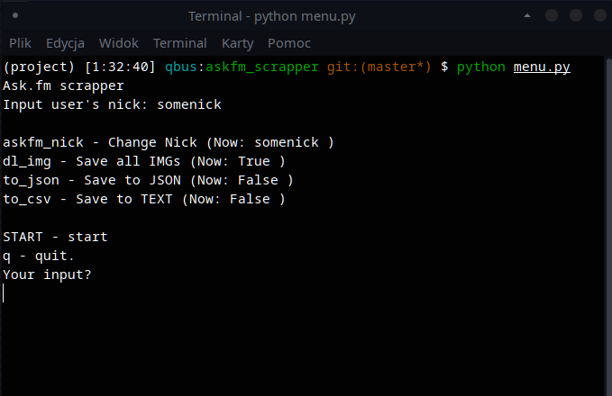

# Simple scraper for Ask.fm 

utilises BeautifulSoup4 and requests library. Tested on Python 3.8.3.



How to use: install BeautifulSoup4, requests and run menu.py
```
pip install requests beautifulsoup4
python menu.py
```

How it works:
Scraper will loop through profile page until there are no more pages (No "Next" button on page).
Scraper will create an object in memory with information from each post on profile.

Saving to JSON and downloading images is possible. There is room for CSV but currently I don't plan adding it.

